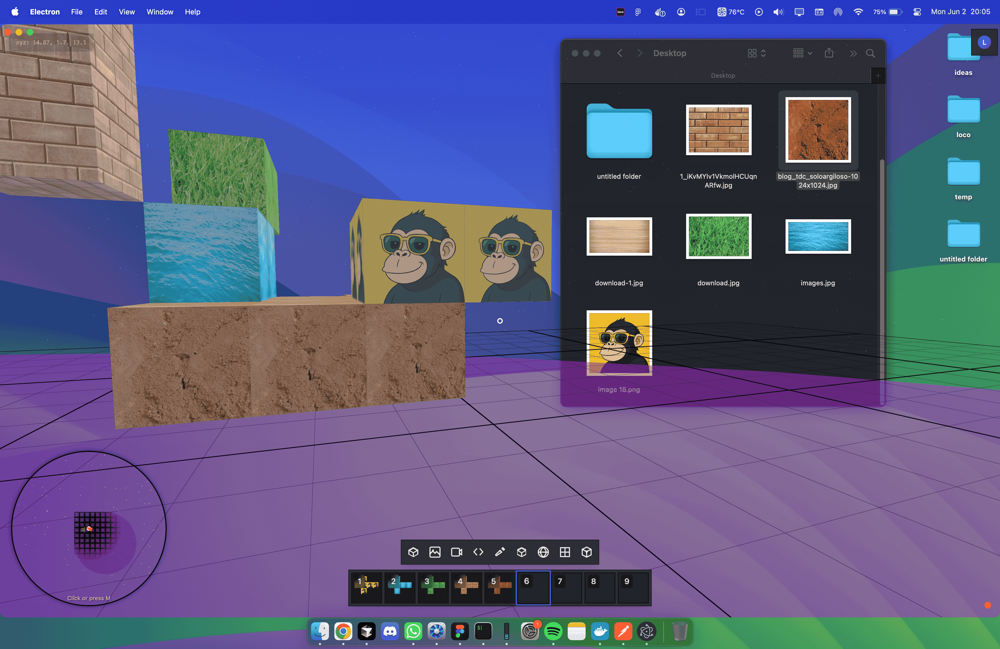
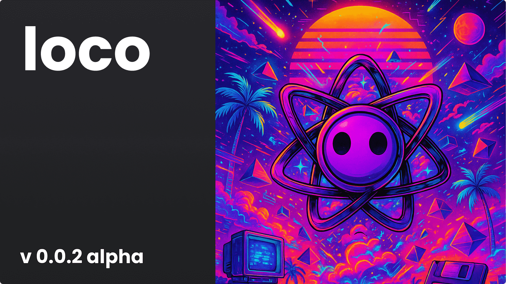

<h1 align="center">LOCO AI</h1>

<p align="center">
  
</p>

<p align="center">
  <strong>A powerful 3D AI-powered interactive environment for immersive </br >digital experiences like Minecraft on your desktop.</strong>
</p>

<p align="center">
  <a href="#features">Features</a> •
  <a href="#installation">Installation</a> •
  <a href="#usage">Usage</a> •
  <a href="#keyboard-shortcuts">Shortcuts</a> •
  <a href="#ai-integration">AI</a> •
  <a href="#development">Development</a> •
  <a href="#contributing">Contributing</a> •
  <a href="#license">License</a>
</p>

<p align="center">
  
  
  
  
</p>

## Features

Loco is a cutting-edge 3D environment that combines powerful technologies to create immersive experiences:

- **AI Integration**:
  - **Ollama Integration**: Connect with local LLMs for private, offline AI assistance
  - **OpenRouter Integration**: Access state-of-the-art commercial models through OpenRouter API
  - **Interview Assistant**: AI-powered preparation for job interviews with feedback
  - **Contextual Chat**: Interact with AI in the 3D environment with spatial awareness
  - **Code Generation**: Use AI to generate and modify code within the environment


- **First-Person Controls**: Intuitive FPS-style navigation with keyboard, mouse, touch, and gamepad support
- **Media Integration**: Import and position images, videos, 3D models, and code blocks in 3D space
- **Interactive Drawing Tools**: Create, annotate, and save drawings directly in 3D space
- **Physics System**: Configurable gravity
- **Extensive Environment Customization**: 
  - Modify sky appearance with turbidity, rayleigh scattering, and sun position
  - Configure star field with adjustable density, color, and depth
  - Customize ground with various shapes, patterns, sizes, and textures
  - Personalize lighting, colors, and visual effects
- **Cross-Platform Controls**: Seamless experience across desktop and mobile with touch-optimized dual joystick controls
- **Dynamic Theming**: Change colors, opacity, and visual settings with real-time preview
- **Model Primitives**: Create basic 3D shapes (cubes, spheres, planes) without external files
- **Collaborative Potential**: Firebase integration for future multi-user experiences
- **Web and Desktop Versions**: Run as a web app or install as a desktop application

## Installation

### Desktop Application

```bash
# Clone the repository
git clone https://github.com/louisperner/loco

# Navigate to the project directory
cd loco

# Install dependencies
yarn

# Start the application
yarn dev
```

### Web Version

```bash
# Run the web version in development mode
yarn dev:browser
```

## Usage

### Desktop Controls

- **Movement**: WASD or Arrow Keys
- **Look Around**: Mouse
- **Add Item**: Left Mouse
- **Remove Item**: Right Mouse
- **Deselect Item**: Q
- **Jump**: Space (when gravity is enabled)
- **Crouch/Move Down**: Left Control
- **Inventory/Catalog**: E
- **Toggle UI**: Tab
- **Show Mouse/Cancel/Menu**: Escape
- **Hotbar Switch Items**: 1, 2, 3, 4, 5, 6, 7, 8, 9
- **Hide App**: Cmd + Shift + Space

### Assistant Controls
- **Spotlight/Chat**: F
- **AI Assistant**: Cmd + B
- **Take Screenshot**: Cmd + H
- **Region Screenshot**: Cmd + 4
- **Generate Solution**: Cmd + Enter

### Mobile Controls

- **Movement**: Left virtual joystick
- **Look Around**: Right virtual joystick
- **Jump**: Jump button (top of left joystick area)
- **Crouch**: Down button (bottom of left joystick area)

### Gamepad Controls

- **Movement**: Left stick
- **Look Around**: Right stick
- **Jump**: A button
- **Crouch**: B button
- **Inventory**: Y button

## Keyboard Shortcuts

| Key         | Function                          |
|---------|-----------------------------------|
| E       | Toggle Inventory                  |
| Tab     | Toggle UI Visibility              |
| Escape  | Show Mouse / Cancel / Close Modal |
| Space   | Jump (with gravity enabled)       |
| Shift   | Sprint                            |
| Ctrl    | Crouch / Move Down                |

| AI Key      | Function                     |
|-------------|------------------------------|
| F                   | Spotlight / AI Chat  |
| CMD + B             | Interview Assistant  |
| CMD + H             | Take Screenshot      |
| CMD + 4             | Region Screenshot    |
| CMD + Enter         | Generate Solution    |
| CMD + Shift + Space | Hide App             |


### Adding Content

1. Press E to open the inventory/catalog
2. Select content type (image, video, 3D model, drawing, code)
3. Upload or create your content
4. Position in 3D space using transform controls
5. Adjust rotation, scale, and other properties as needed

### Environment Controls

- Access the settings panel to customize your environment
- Adjust sky parameters including color, sun position, and atmospheric effects
- Configure star field visibility, density, and appearance
- Modify ground size, shape, color, and grid pattern
- Toggle gravity and physics properties
- Save custom themes for future sessions

## AI Integration

Loco features comprehensive AI capabilities that enhance your 3D environment experience:

### Ollama Integration

Connect to locally-running Ollama models for private, secure AI assistance:

1. Install [Ollama](https://ollama.ai/) on your system
2. Run your preferred model locally (e.g., `llama3`, `mistral`, `phi`)
3. Configure the connection in Loco's settings
4. Select from available models within the interface

### OpenRouter Integration

Access leading commercial AI models through the OpenRouter API:

1. Create an account at [OpenRouter](https://openrouter.ai/)
2. Generate an API key in your OpenRouter dashboard
3. Add your API key in Loco's settings
4. Select from available models within the interface

### AI Chat Features

- **Contextual Awareness**: Chat with AI that understands your 3D environment
<!-- - **Asset Generation**: Request the AI to create images, 3D models, or code -->
- **Environment Modification**: Use natural language to adjust lighting, colors, and physics
- **Spatial Memory**: AI remembers the location and context of previous interactions
<!-- - **Multi-modal Inputs**: Combine voice, text, and gestures for intuitive AI interaction -->

## Development

Loco is built with:

- **React**: UI framework (v19.1.0)
- **Three.js**: 3D rendering (v0.175.0)
- **Electron**: Desktop application framework (v34.3.3)
- **TypeScript**: Type-safe JavaScript
- **Tailwind CSS**: Styling (v3.4.1)

### Development Commands

```bash
# Run in development mode
npm run dev

# Build for production
npm run build

# Package desktop app
npm run package

# Make distributable
npm run make

# Run web version
npm run dev:browser
```

## Firebase Authentication Setup

To use the Firebase authentication features, you need to create a Firebase project and configure it:

1. Create a Firebase project at [firebase.google.com](https://firebase.google.com)
2. Register your app in the Firebase console
3. Enable Authentication in the Firebase console:
   - Go to Authentication > Sign-in method
   - Enable Email/Password and Google authentication methods
4. Create a `.env` file in the root directory with the following:

```
# Firebase Configuration
VITE_FIREBASE_API_KEY=your-api-key
VITE_FIREBASE_AUTH_DOMAIN=your-auth-domain
VITE_FIREBASE_PROJECT_ID=your-project-id
VITE_FIREBASE_STORAGE_BUCKET=your-storage-bucket
VITE_FIREBASE_MESSAGING_SENDER_ID=your-messaging-sender-id
VITE_FIREBASE_APP_ID=your-app-id
```

Replace the placeholder values with your Firebase project's configuration, which you can find in your Firebase project settings.

## Application Signing (macOS)

If you're encountering a "damaged and can't be opened" error on macOS after downloading the built application, you need to sign the application with a valid Apple Developer ID.

### Requirements

1. An Apple Developer account
2. A valid Developer ID Application certificate

### Signing Process

1. Build the application first:
   ```
   npm run make
   ```

2. Run the signing script:
   ```
   ./sign-app.sh
   ```

   The script will:
   - List available signing identities
   - Ask you to input your Developer ID
   - Sign the application with the specified identity
   - Create a signed DMG
   - Verify the signature

3. Alternatively, you can configure automatic signing in `forge.config.js`:
   - Update the `osxSign.identity` with your Developer ID
   - If you want to notarize your app, uncomment and configure the `osxNotarize` section

### Manual Signing

If you prefer to sign manually, use:
```bash
codesign --force --options runtime --entitlements "./entitlements.plist" --sign "YOUR_DEVELOPER_ID" "./out/loco-darwin-x64/loco.app" --deep --verbose
```

### Troubleshooting

If you still encounter issues:
1. Make sure you have a valid Developer ID
2. Try removing any quarantine attributes: `xattr -d com.apple.quarantine /path/to/your/app`
3. Check Apple's documentation on notarization for distribution: [Apple Documentation](https://developer.apple.com/documentation/security/notarizing_macos_software_before_distribution)

---

## Contributing

Contributions are welcome! Feel free to open issues or submit pull requests to help improve Loco.

1. Fork the repository
2. Create your feature branch (`git checkout -b feature/amazing-feature`)
3. Commit your changes (`git commit -m 'Add some amazing feature'`)
4. Push to the branch (`git push origin feature/amazing-feature`)
5. Open a Pull Request

## License

This project is licensed under the MIT License - see the LICENSE file for details.
</br>
</br>
</br>
</br>
<p align="center">
  
</p>

<p align="center">
  Made with ❤️ by <a href="https://datamonkeys.ai" target="_blank" rel="noopener noreferrer">datamonkeys.ai</a> and <a href="https://louisperner.dev" target="_blank" rel="noopener noreferrer">louisperner.dev</a>.
  <br /> For creators, developers, and dreamers.
</p>
